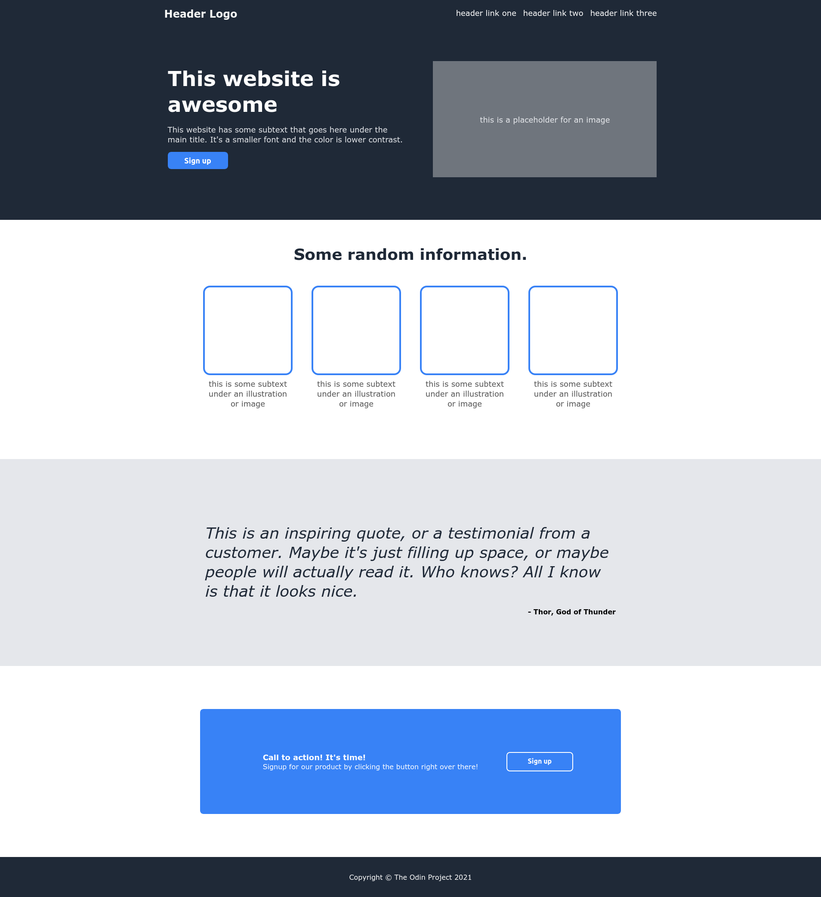

# The Odin Project Demo

This is a solution to the [Landing Page activity of The Odin Project](https://www.theodinproject.com/paths/foundations/courses/foundations/lessons/landing-page). For this project, I created an entire web page from a design that is already provided by the course.

## Table of contents

- [Overview](#overview)
  - [The challenge](#the-challenge)
  - [Screenshot](#screenshot)
  - [Links](#links)
- [My process](#my-process)
  - [Built with](#built-with)
  - [What I learned](#what-i-learned)
  - [Useful resources](#useful-resources)
- [Author](#author)

## Overview

### The challenge

Create an entire web page from the design provided by The Odin Project. Get the project as close to the design.

### Screenshot

### Links

- Live Site URL: [Github Page](https://code-mma.github.io/top-demo/)

## My process

### Built with

- Semantic HTML5 markup
- CSS custom properties
- CSS Flexbox

### What I learned

From this exercise, I had a chance to train my skills in CSS Flexbox while using browser development tools.

### Useful resources

- [The Odin Project](https://www.theodinproject.com) - The site that guided me to become better at frontend development.

## Author

- GitHub Profile - [Michael Angelo](https://github.com/code-mma)